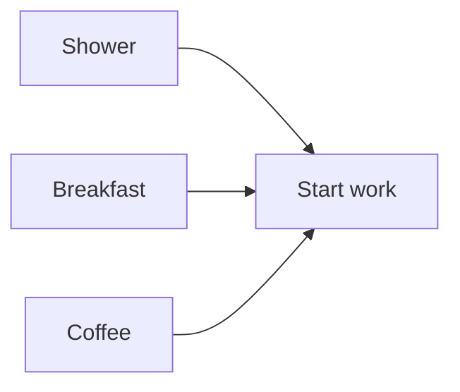
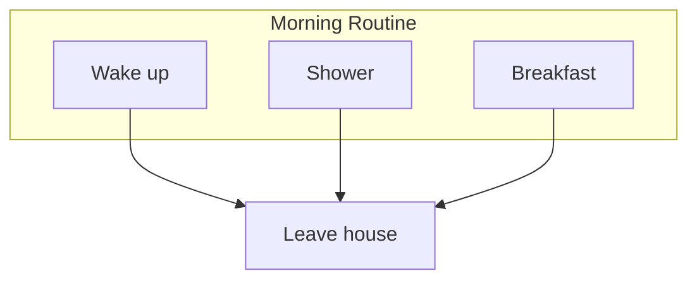
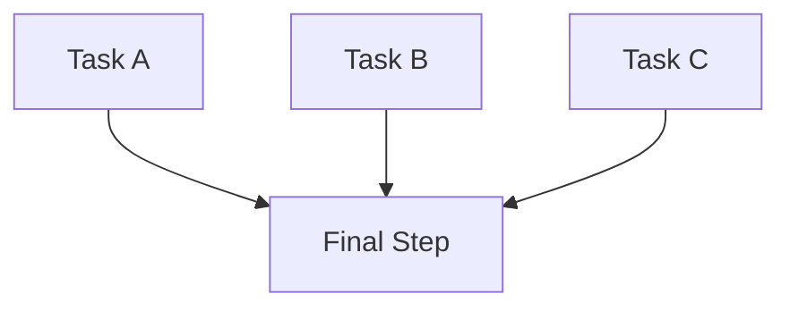
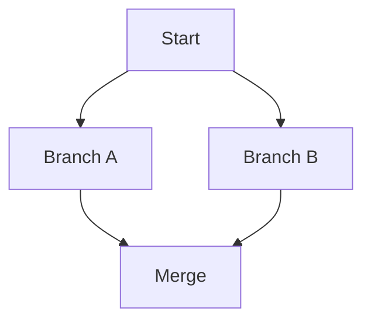
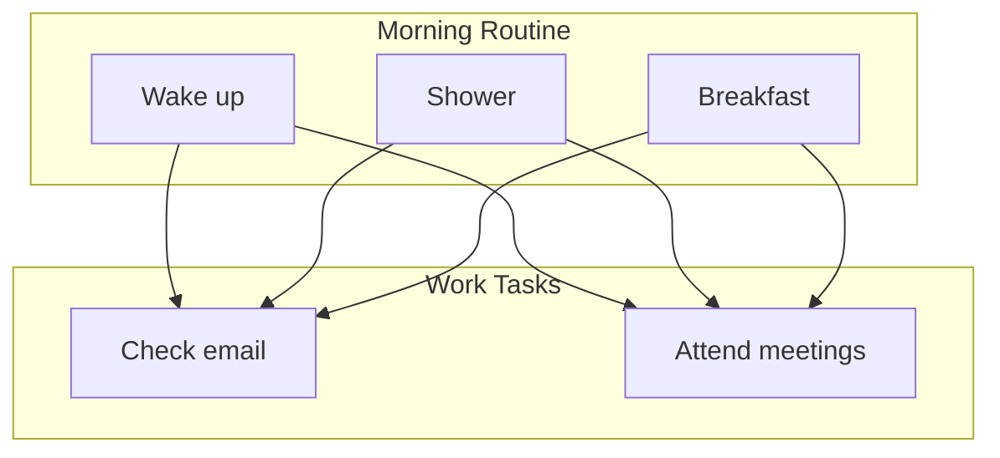

# Categories & Dependencies

Understand how to organize tasks and create dependency relationships.

## Categories

Categories group related tasks together for organization and bulk dependencies.

### Category Structure

```yaml
categories:
  - name: Category Name        # Required: unique identifier
    description: Description   # Optional: human-readable text
    todos: []                   # Required: list of tasks
```

### Category Example

```yaml
categories:
  - name: Morning Routine
    description: "Tasks to complete each morning"
    todos:
      - title: "Wake up"
      - title: "Shower"
      - title: "Breakfast"
```

### Category Rules

- **Names must be unique** — Each category needs a distinct name
- **Case-sensitive** — "Morning Routine" ≠ "morning routine"
- **Used as identifiers** — Referenced in `depends_on_categories`

## Dependency Types

Taskin supports three types of dependencies:

1. **Task Dependencies** (`depends_on_todos`)
2. **Category Dependencies** (`depends_on_categories`)
3. **One-off Dependencies** (`depends_on_all_oneoffs`)

### Task Dependencies

Tasks that must complete before this task becomes available.

```yaml
- title: "Lunch"
  depends_on_todos:
    - "Breakfast"
```

**Visualization**:


**Multiple Dependencies**:

```yaml
- title: "Start work"
  depends_on_todos:
    - "Shower"
    - "Breakfast"
    - "Coffee"
```



### Category Dependencies

All tasks in a category must complete before this task becomes available.

```yaml
- title: "Leave house"
  depends_on_categories:
    - "Morning Routine"
```

If "Morning Routine" contains "Wake up", "Shower", and "Breakfast", then all three must be complete before "Leave house" is available.

**Visualization**:



### One-off Dependencies

Wait for all dynamically created one-off tasks:

```yaml
- title: "End of day"
  depends_on_all_oneoffs: true
```

This ensures all ad-hoc tasks are completed before this task becomes available.

## Dependency Resolution

### Recommended Tasks

The system calculates "recommended" tasks using the Deep Dependency Map (DDM):

1. **Build graph** — Create dependency relationships
2. **Check prerequisites** — Verify all dependencies are satisfied
3. **Return available** — Only show tasks ready to work on

Example:

```yaml
categories:
  - name: Cooking
    todos:
      - title: "Buy groceries"
      - title: "Prep ingredients"
        depends_on_todos: ["Buy groceries"]
      - title: "Cook meal"
        depends_on_todos: ["Prep ingredients"]
```

**Initial state** — Only "Buy groceries" is recommended
**After "Buy groceries"** — "Prep ingredients" becomes recommended
**After "Prep ingredients"** — "Cook meal" becomes recommended

### Transitive Dependencies

Dependencies are resolved transitively. If A → B → C, completing A makes B available, not C.

```yaml
- title: "A"
- title: "B"
  depends_on_todos: ["A"]
- title: "C"
  depends_on_todos: ["B"]
```

**Progression**:
1. Complete "A" → "B" becomes available
2. Complete "B" → "C" becomes available

You cannot skip "B" and go straight to "C".

## Dependency Patterns

### Linear Chain

Tasks follow a strict sequence:

```yaml
categories:
  - name: Process
    todos:
      - title: "Step 1"

      - title: "Step 2"
        depends_on_todos: ["Step 1"]

      - title: "Step 3"
        depends_on_todos: ["Step 2"]

      - title: "Step 4"
        depends_on_todos: ["Step 3"]
```


### Parallel Dependencies

Multiple tasks must complete before proceeding:

```yaml
categories:
  - name: Preparation
    todos:
      - title: "Task A"
      - title: "Task B"
      - title: "Task C"

      - title: "Final Step"
        depends_on_todos:
          - "Task A"
          - "Task B"
          - "Task C"
```



### Diamond Pattern

Converge and diverge:

```yaml
categories:
  - name: Workflow
    todos:
      - title: "Start"

      - title: "Branch A"
        depends_on_todos: ["Start"]

      - title: "Branch B"
        depends_on_todos: ["Start"]

      - title: "Merge"
        depends_on_todos:
          - "Branch A"
          - "Branch B"
```



### Category Gating

Use categories to gate access to later tasks:

```yaml
categories:
  - name: Morning Routine
    todos:
      - title: "Wake up"
      - title: "Shower"
      - title: "Breakfast"

  - name: Work Tasks
    todos:
      - title: "Check email"
        depends_on_categories:
          - "Morning Routine"

      - title: "Attend meetings"
        depends_on_categories:
          - "Morning Routine"
```



## Cross-Category Dependencies

Tasks can depend on tasks or categories in other groups:

```yaml
categories:
  - name: Kitchen
    todos:
      - title: "Clean dishes"

  - name: Living Room
    todos:
      - title: "Vacuum"
        depends_on_todos:
          - "Clean dishes"
```

This creates dependencies across different areas.

## Circular Dependencies

Circular dependencies are **not allowed** and will cause issues:

```yaml
# ❌ Invalid
- title: "Task A"
  depends_on_todos: ["Task B"]

- title: "Task B"
  depends_on_todos: ["Task A"]
```

The system will detect and prevent these during graph construction.

## Skipped Tasks

When a task is skipped, it's treated as "complete" for dependency purposes:

```yaml
- title: "Dinner"
  depends_on_todos: ["Lunch"]
```

If you skip "Lunch", "Dinner" becomes available.

This prevents skipped tasks from blocking your entire routine.

## Best Practices

### Keep It Simple

Start with minimal dependencies:

```yaml
# ✅ Good start
- title: "Breakfast"
- title: "Lunch"
  depends_on_todos: ["Breakfast"]
```

Add complexity as needed:

```yaml
# ✅ Add more as you refine
- title: "Breakfast"
  depends_on_todos: ["Wake up", "Make coffee"]
```

### Use Categories for Routines

Group related tasks and create category dependencies:

```yaml
categories:
  - name: Morning
    todos: [...]  # Morning tasks

  - name: Afternoon
    todos:
      - title: "Afternoon task"
        depends_on_categories: ["Morning"]
```

### Avoid Deep Chains

Long chains are fragile:

```yaml
# ❌ Fragile - breaks if any step fails
A → B → C → D → E → F → G
```

Better: Group into categories:

```yaml
# ✅ More robust
Category 1: A → B → C
Category 2: D → E (depends on Category 1)
Category 3: F → G (depends on Category 2)
```

### Document Complex Dependencies

Use descriptions to explain non-obvious dependencies:

```yaml
- title: "Deep clean bathroom"
  description: "Requires clean towels from laundry"
  depends_on_todos:
    - "Finish laundry"
  reset_interval: 7
```

## Visualization

### Dependency Graph View

Access the interactive graph at `/graph` to see:

- All tasks and categories
- Dependency relationships
- Color-coded categories
- Scoped vs. full graph views

This helps you understand your task structure visually.

## Debugging Dependencies

### Task Not Appearing in Recommendations?

Check:

1. **Are dependencies complete?**
   ```bash
   curl http://localhost:8000/api/todos
   ```

2. **Is the task already complete?**
   Only incomplete/in-progress tasks are recommended

3. **Are category dependencies satisfied?**
   All tasks in dependent categories must be complete

### Unexpected Task Order?

Review the dependency graph:

1. Open `/graph` in your browser
2. Enable "Full" graph view
3. Trace dependencies visually

## Next Steps

- [Task Configuration](tasks.md) — Define individual tasks
- [Reset Intervals](reset-intervals.md) — Configure reset behavior
- [Dependency Graph](../features/dependency-graph.md) — Visualize your structure
