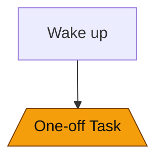

# One-off Tasks

Manage ad-hoc, temporary tasks that don't fit into your regular routine.

## Overview

One-off tasks are dynamically created tasks for temporary, non-recurring activities. Unlike regular tasks defined in `config.yml`, one-offs are created on-demand through the UI or API.

## Key Differences

| Feature      | Regular Tasks     | One-off Tasks        |
| ------------ | ----------------- | -------------------- |
| Definition   | `config.yml`      | Dynamic via API/UI   |
| Persistence  | Always exists     | Can be deleted       |
| Reset        | Based on interval | Never auto-reset     |
| Dependencies | Configurable      | Default dependencies |

## Creating One-off Tasks

### Via API

```bash
curl -X POST http://localhost:8000/api/oneoff-todos \
  -H "Content-Type: application/json" \
  -d '{
    "title": "Buy groceries",
    "description": "Milk, bread, eggs"
  }'
```

### Via UI

1. Navigate to the "One-offs" page
2. Click "Add Task"
3. Enter title and optional description
4. Click "Create"

## Dependencies

Configure default dependencies for all one-off tasks in `config.yml`:

```yaml
oneoff_deps:
  depends_on_todos:
    - "Wake up"
  depends_on_categories:
    - "Morning Routine"
```

This ensures one-off tasks respect your routine:

```yaml
# With above config, one-offs automatically depend on:
# - "Wake up" task being complete
# - All tasks in "Morning Routine" being complete
```

### No Default Dependencies

If not specified, one-offs have no dependencies:

```yaml
# Empty config
oneoff_deps: {}

# Or minimal config
oneoff_deps:
  depends_on_todos: []
  depends_on_categories: []
```

## Task States

One-offs follow the same state machine as regular tasks:

- **incomplete** — Not started
- **in-progress** — Currently working on
- **complete** — Finished
- **skipped** — Intentionally skipped

## Recommendations

One-offs appear in the recommended list when:

1. Task is `incomplete` or `in-progress`
2. Default dependencies are satisfied
3. If any regular task has `depends_on_all_oneoffs: true`, those tasks wait for all one-offs

## Configuration Examples

### Morning Gate

Prevent one-offs until morning routine complete:

```yaml
oneoff_deps:
  depends_on_categories:
    - "Morning Routine"
```

### Specific Prerequisites

Require specific tasks first:

```yaml
oneoff_deps:
  depends_on_todos:
    - "Check calendar"
    - "Check to-do list"
```

### No Dependencies

One-offs always available:

```yaml
oneoff_deps:
  depends_on_todos: []
  depends_on_categories: []
```

## Blocking Regular Tasks

Make regular tasks wait for all one-offs:

```yaml
categories:
  - name: Evening
    todos:
      - title: "Review day"
        depends_on_all_oneoffs: true
        description: "Ensures all ad-hoc tasks are handled"
```

This creates a gate: complete all one-offs before this task becomes available.

### Use for True One-offs

Don't create recurring tasks as one-offs. Use regular tasks with appropriate reset intervals instead.

```yaml
# ✅ Recurring task - use config.yml
- title: "Weekly shopping"
  reset_interval: 7
```

## Dependency Graph

One-offs appear in the dependency graph as orange stadium-shaped nodes:



View in the graph to understand their relationships.

## Next Steps

- [Task Configuration](tasks.md) — Configure regular tasks
- [Dependencies](dependencies.md) — Understand dependency types
